## Introduction
As a **private secondary school tutor** in Singapore, it can be hard to **manage student contacts**,
**track payments** and **schedule lessons** with such a big group of people. Unless you are willing to fork out high prices for premium services meant
for larger tuition centre businesses, it means a lot of **unnecessary hassle** and much **room for error**.

Tuiniverse is the solution for all things tuition!
Tuiniverse is a **desktop app** which <u>expedites</u>:
* Student contact storing and upkeep
* Payment tracking
* Lesson scheduling

All of this is displayed done with optimized typing (via a Command Line Interface) layered within graphical
display of all the information you need.

<!-- * Table of Contents -->
<page-nav-print />

--------------------------------------------------------------------------------------------------------------------

## Quick start

1. Ensure you have Java `17` or above installed in your Computer. 

Operating System | What to expect
-----------------|------------------
Mac|  Follow the Java installation instructions [here](https://se-education.org/guides/tutorials/javaInstallationMac.html)
Windows| Follow the Java installation instructions [here](https://se-education.org/guides/tutorials/javaInstallationWindows.html)
Linux | Follow the Java installation instructions [here](https://se-education.org/guides/tutorials/javaInstallationLinux.html)

2. Download the latest `.jar` file from [here](https://github.com/AY2526S1-CS2103T-W08-2/tp/releases/tag/v1.5.1).

3. Copy the file to the folder you want to use as the _home folder_ for your Tuiniverse app (e.g. `Desktop/Tuiniverse`).

4. Open a command terminal, and type `cd [folder/path]` into the home folder of your jar, eg `cd Desktop/Tuiniverse`.

5. Use the `java -jar tuiniverse.jar` command to run the application. 
   A GUI similar to the below should appear in a few seconds. Note how the app contains some sample data. 
   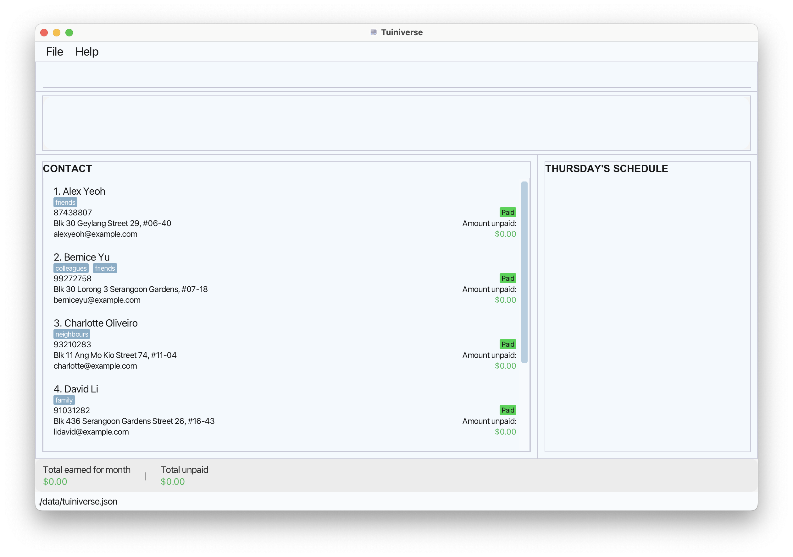

## Familiarisation
To get adjusted to using Tuiniverse, we have created a short practice to keep users up to track on how to use the app.

Type some commands into the command box and press Enter to execute it. e.g. typing **`help`** and pressing Enter will open the help window. 

Some example commands you can try:
* `list` : Lists all student contacts.

* `add n/John Doe p/98765432 e/johnd@example.com a/311, Clementi Ave 2, #02-25 t/friends t/owesMoney` : Adds a student named `John Doe` to the student list.

* `delete 3` : Deletes the 3rd student shown in the current list.

* `clear` : Deletes all students and lessons.

* `exit` : Exits the app.

Refer to the [Features](#features) below for more details of each command.

--------------------------------------------------------------------------------------------------------------------

## Command summary

Action | Format, Examples
--------|------------------
**Add Student** | `add n/NAME p/PHONE_NUMBER e/EMAIL a/ADDRESS [t/TAG]…​`   e.g., `add n/John Doe p/98765432 e/johnd@example.com a/311, Clementi Ave 2, #02-25 t/friends t/owesMoney`
**Add Lesson** | `add.lesson i/STUDENT_INDEX s/SUBJECT l/LEVEL d/DAY st/START_TIME et/END_TIME r/HOURLY RATE`   e.g., `add.lesson i/1 s/English l/2 d/Monday st/10:00 et/12:00 r/80 `
**View** | `view INDEX`  e.g., `view 1`
**List** | `list`
**List Paid** | `list.paid`
**List Unpaid** | `list.unpaid`
**List Overdue** | `list.overdue`
**Find** | `find KEYWORD [MORE_KEYWORDS]`  e.g., `find James Jake`
**Edit Student** | `edit`   e.g., `edit 1 p/91234567 e/johndoe@example.com`
**Edit Lesson** | `edit.lesson`   e.g., `edit.lesson i/1 c/2 d/Monday r/44`
**Pay** | `pay INDEX`  e.g., `pay 3`
**Delete Student** | `delete INDEX`  e.g., `delete 3`
**Delete Lesson** | `delete.lesson i/STUDENT_INDEX c/LESSON_INDEX…​`  e.g.,`delete.lesson i/2 c/1`
**Clear** | `clear`
**Help** | `help`
**Exit** | `exit`

--------------------------------------------------------------------------------------------------------------------

## User Interface (UI) Overview
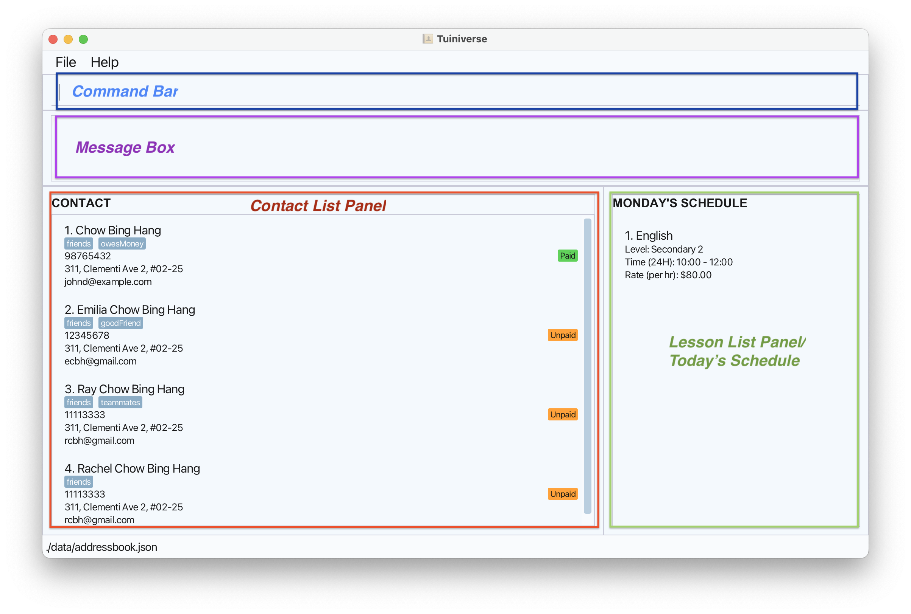

| UI Element                           | Description                                                                                                         |
|--------------------------------------|---------------------------------------------------------------------------------------------------------------------|
| **Command Bar**                      | Primary input field for entering commands like find, list and add.                                                  |
| **Message Box**                      | Displays temporary feedback, including success confirmations and error messages, following a user action.           |
| **Contact List Panel**               | View students' contact details here.                                                                                |
| **Lesson List Panel/Today Schedule** | Displays the scheduled lessons of the day. This panel can be toggled to show all the lessons of a selected student. |
| **Amount Panel**                | View summary of earnings and payment here.

## Features

<box type="info" seamless>

**Notes about the command format:** 

* Words in `UPPER_CASE` are the parameters to be supplied by the user. 
  e.g. in `add n/NAME`, `NAME` is a parameter which can be used as `add n/John Doe`.

* Items in square brackets are optional. 
  e.g `n/NAME [t/TAG]` can be used as `n/John Doe t/friend` or as `n/John Doe`.

* Items with `…`​ after them can be used multiple times including zero times. 
  e.g. `[t/TAG]…​` can be used as ` ` (i.e. 0 times), `t/friend`, `t/friend t/family` etc.

* Parameters can be in any order. 
  e.g. if the command specifies `n/NAME p/PHONE_NUMBER`, `p/PHONE_NUMBER n/NAME` is also acceptable.

* Extraneous parameters for commands that do not take in parameters (such as `help`, `list`, `exit` and `clear`) will be ignored. 
  e.g. if the command specifies `help 123`, it will be interpreted as `help`.

* If you are using a PDF version of this document, be careful when copying and pasting commands that span multiple lines as space characters surrounding line-breaks may be omitted when copied over to the application.
  </box>

 

### Viewing help : `help`

Shows a message explaining how to access the help page.

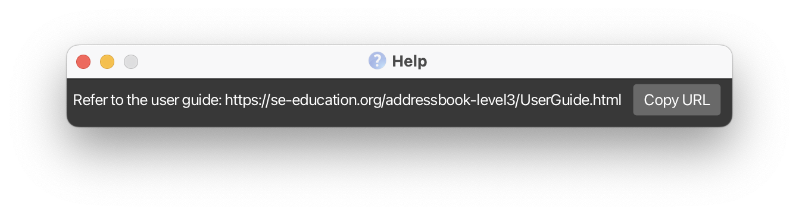

**Format:** `help`

 

### Adding a student: `add`

Adds a student to the address book.

| **Field** | **Prefix** | **Description / Constraints**                                      |
|------------|-------------|--------------------------------------------------------------------|
| **Name** | `n/` | The student’s full name.                                           |
| **Phone** | `p/` | A Singaporean phone number containing 3–8 numerical digits.        |
| **Email** | `e/` | Must be a valid email format (e.g., `example@email.com`).          |
| **Address** | `a/` | Can include spaces and punctuation.                                |
| **Tag(s)** | `t/` | Alphanumerical values only, with no spaces. Multiple tags allowed. |

**Format:** `add n/NAME p/PHONE_NUMBER e/EMAIL a/ADDRESS [t/TAG]…​`

<box type="tip" seamless>

**Tip:** Tag is optional
</box>

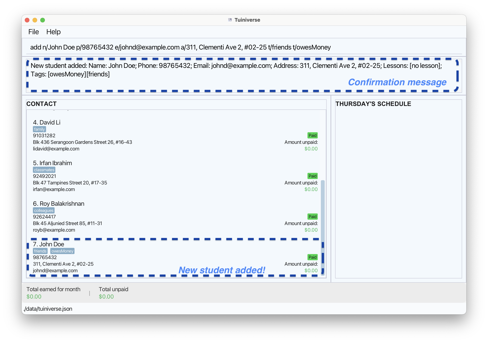

**Examples:**
* `add n/John Doe p/98765432 e/johnd@example.com a/John street, block 123, #01-01`
* `add n/Betsy Crowe t/friend e/betsycrowe@example.com a/Newgate Prison p/1234567 t/criminal`

 

### Adding a lesson: `add.lesson`

Adds a lesson to the specific student.

| **Field** | **Prefix** | **Constraints**                                                                     |
|------------|---------|-------------------------------------------------------------------------------------|
| **Student Index** | `i/`    | The index of the student in the displayed list.                                     |
| **Subject** | `s/`    | Subject taught (Refer to [Glossary](#glossary) for the list of available subjects). |
| **Level** | `l/`    | An integer between 1–5 (Refer to [Glossary](#glossary) for definition).             |
| **Day of Lesson** | `d/`    | Day of the week (e.g., `Monday`, `Tuesday`, ...).                                   |
| **Start Time** | `st/`   | Time in 24-hour format — `HH:MM`.                                                   |
| **End Time** | `et/`   | Time in 24-hour format — `HH:MM`.                                                   |
| **Hourly Rate** | `r/`    | Must be a non-negative numerical value (Refer to [Glossary](#glossary) for definition).                                            |

<box type="tip" seamless>

**Notes**:
When you add a lesson in Tuiniverse, it’s assumed to run every week from the first to the last week of the month.

For example, if October 2025 has five Thursdays and you schedule a Thursday lesson, it will be set for all five Thursdays. The total payment will be calculated based on this.
</box>

**Format:** `add.lesson i/STUDENT_INDEX s/SUBJECT l/LEVEL d/DAY st/START_TIME et/END_TIME r/HOURLY RATE`

**Examples:**
* `add.lesson i/1 s/English l/2 d/Monday st/10:00 et/12:00 r/80`

 

### List all lessons of a student: `view`

Lists all the lessons taken by the specified student.

**Format:** `view INDEX`
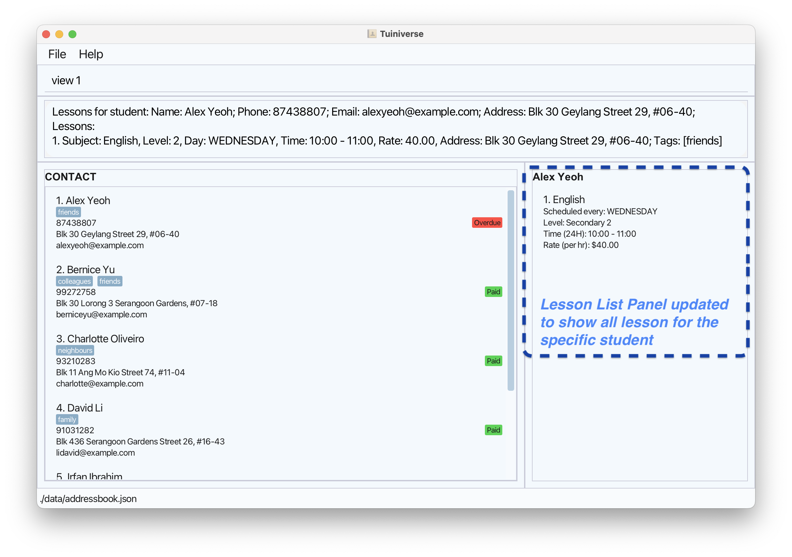

* List the lessons of the student at the specified `INDEX`.
* The index refers to the index number shown in the displayed student list.
* The index **must be a positive integer** 1, 2, 3, …​

**Examples:**
* `list` followed by `view 2` views the lessons of the 2nd student in the address book.
* `find Betsy` followed by `view 1` views the 1st student in the results of the find command.

 

### Listing all students : `list`

Shows a list of all students in the contact book.

**Format:** `list`
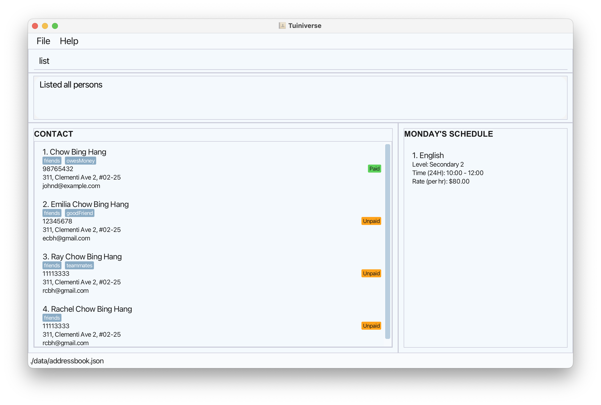
### Listing all payments: `list.paid`
Lists all students that have **paid** their fees for the month.

Refer to [Glossary](#glossary) for the definition of **paid**.

**Format:** `list.paid`
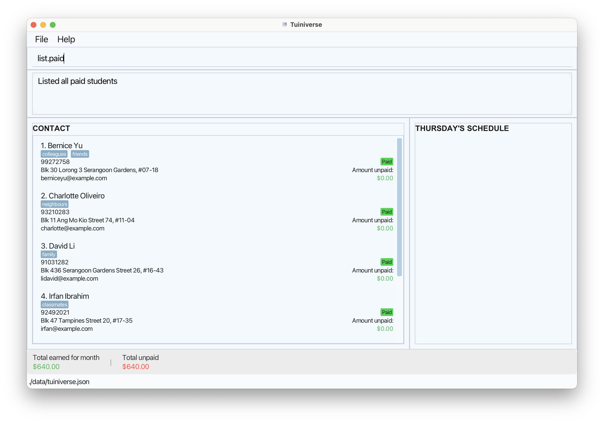

### Listing all unpaid fees: `list.unpaid`
Lists all students that have **unpaid** fees for the month. 

Refer to [Glossary](#glossary) for the definition of **unpaid**.

**Format:** `list.unpaid`
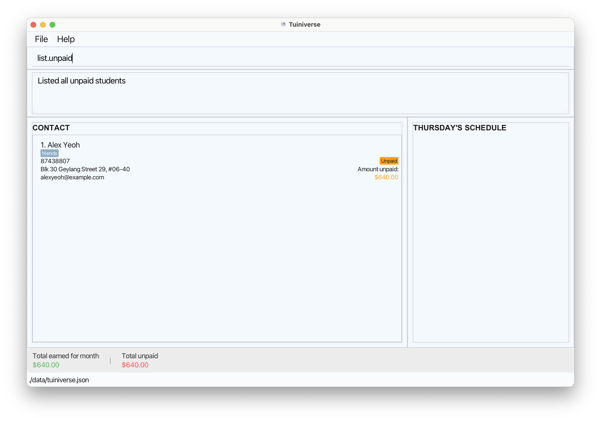

### Listing all overdue fees: `list.overdue`
Lists all students that have **overdue** fees from previous months.

Refer to [Glossary](#glossary) for the definition of **overdue**.

**Format:** `list.overdue`

### Searching for students by keyword: `find`

 

**Format:** `find KEYWORD [MORE_KEYWORDS]`
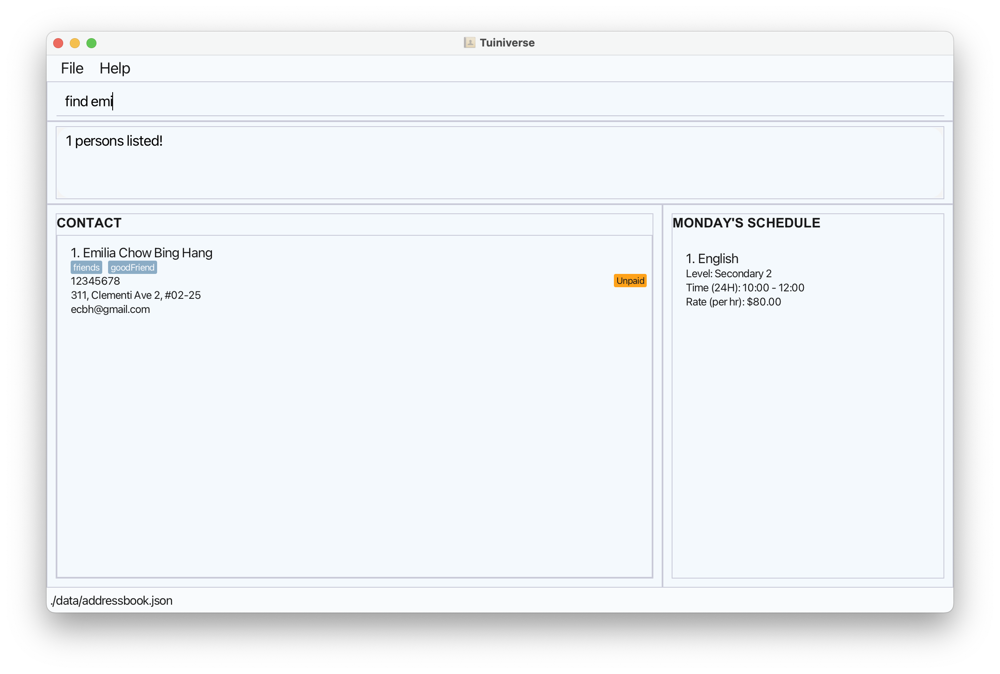

* The search is case-insensitive. e.g `hans` will match `Hans`
* The order of the keywords does not matter. e.g. `Hans Bo` will match `Bo Hans`
* The name, address, email and phone number can be searched.
* Any substring of a word will be matched e.g. `Han` will match `Hans`
* Students matching at least one keyword will be returned (i.e. `OR` search).
  e.g. `Hans Bo` will return `Hans Gruber`, `Bo Yang`

**Examples:**
* `find John` returns `john` and `John Doe`
* `find alex 91031282` returns `Alex Yeoh`, `David Li` 

 

### Editing a student : `edit`

Edits an existing student in the contact book.

**Format:** `edit INDEX [n/NAME] [p/PHONE] [e/EMAIL] [a/ADDRESS] [t/TAG]…​`

* Edits the student at the specified `INDEX`. The index refers to the index number shown in the displayed student list. The index **must be a positive integer** 1, 2, 3, …​
* At least one of the optional fields must be provided.
* Existing values will be updated to the input values.
* When editing tags, the existing tags of the student will be removed i.e adding of tags is not cumulative.
* You can remove all the student’s tags by typing `t/` without
  specifying any tags after it.

<box type="info" seamless>

**Note:**
Constraints for editing a student are the same as in [Add student](#adding-a-student-add)

</box>

**Examples:**
*  `edit 1 p/91234567 e/johndoe@example.com` Edits the phone number and email address of the 1st student to be `91234567` and `johndoe@example.com` respectively.
*  `edit 2 n/Betsy Crower t/` Edits the name of the 2nd student to be `Betsy Crower` and clears all existing tags.

 

### Editing a lesson : `edit.lesson`

Edits the details of the lesson of the student identified by the index number used in the displayed person list.
Existing values will be overwritten by the input values.

**Format:** `edit.lesson i/STUDENT_INDEX c/LESSON_INDEX [s/SUBJECT] [d/DAY] [l/LEVEL] [r/RATE] [st/START TIME et/END TIME]…​`

<box type="warning" seamless>

**Caution:**
To ensure that you edit the correct lesson from a selected student, use the `view` command <b>first</b> to display the student's details, then specify the lesson index shown in the lesson list panel.
Trying to edit a lesson before viewing the student's lesson (via `view` command) may result in a wrong lesson being edited.
</box>

* Edits the lesson at the specified `LESSON_INDEX` of the student at`STUDENT_INDEX`.
* The index refers to the index number shown in the displayed student list & lesson list respectively. The index **must be a positive integer** 1, 2, 3, …​
* At least one of the optional fields must be provided.
* Existing values will be updated to the input values.

<box type="info" seamless>

**Note:**
Constraints for student are the same as in [Add lesson](#adding-a-lesson-addlesson)

</box>

**Examples:**
*  `edit.lesson i/1 c/2 d/Monday r/44` Edits the 2nd lesson of the 1st student to be scheduled on every `Monday` at a rate of `$44/hr`.

 

### Making payment: `pay`
Tracks that a student has made payment for that month.

**Format:** `pay INDEX`

* Marks payment for the student at the specified `INDEX`. The index refers to the index number shown in the displayed student list. The index **must be a positive integer** 1, 2, 3, …​
* When you mark an **unpaid** or **overdue** student as paid, their status becomes **paid**.
* A **paid** student cannot make payment until the next month.

 

### Deleting a student : `delete`

Deletes the specified student from the address book.

**Format:** `delete INDEX`
Before delete:
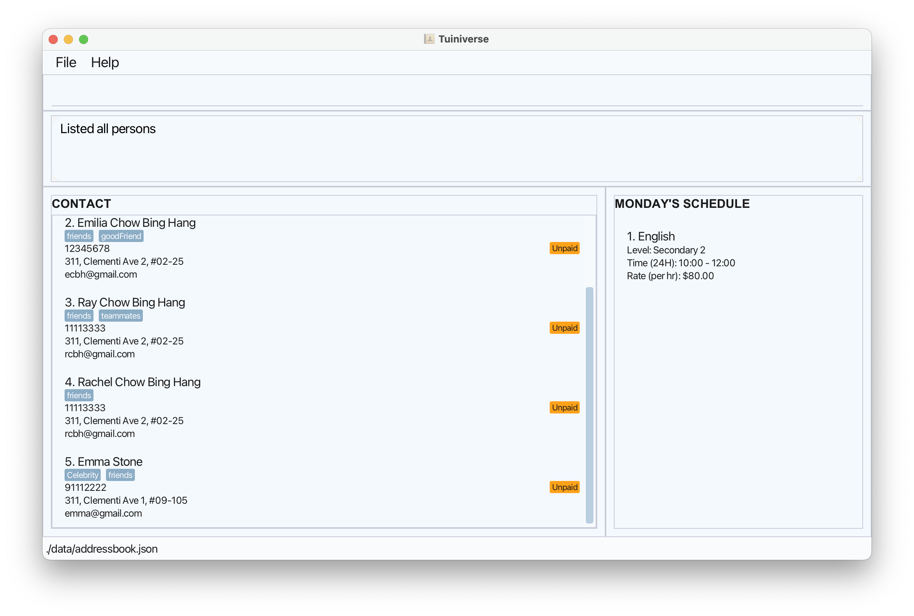
After delete:
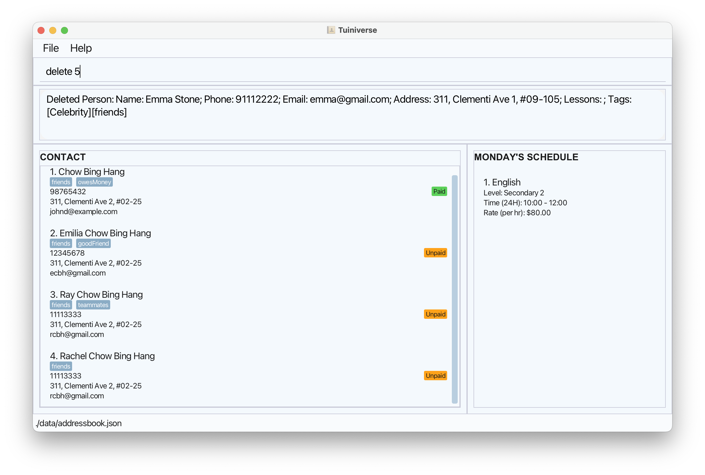

* Deletes the student at the specified `INDEX`.
* The index refers to the index number shown in the displayed student list.
* The index **must be a positive integer** 1, 2, 3, …​
* Deleting a student also delete away their related class and payment record for the month.

**Examples:**
* `list` followed by `delete 2` deletes the 2nd student in the address book.
* `find Betsy` followed by `delete 1` deletes the 1st student in the results of the `find` command.

 

### Deleting a Lesson: `delete.lesson`

Deletes an existing lesson from a specific student.

**Format:**`delete.lesson i/STUDENT_INDEX c/LESSON_INDEX…​`

<box type="warning" seamless>

**Caution:**
To ensure that you delete the correct lesson from a selected student, use the `view` command <b>first</b> to display the student's details, then specify the lesson index shown in the lesson list panel.
Trying to delete a lesson before viewing the student's lesson (via `view` command) may result in a wrong lesson being deleted.
</box>

**Examples:**
* `delete.lesson i/2 c/1`

 

### Clearing all entries : `clear`

Clears all entries from the address book.

**Format:** `clear`

 

### Exiting the program : `exit`

Exits the program.

**Format:** `exit`

 

### Saving the data

Tuiniverse data are saved in the hard disk automatically after any command that changes the data. There is no need to save manually.

 

### Editing the data file

Tuiniverse data are saved automatically as a JSON file `[JAR file location]/data/tuiniverse.json`. Advanced users are welcome to update data directly by editing that data file.

<box type="warning" seamless>

**Caution:**
If your changes to the data file makes its format invalid, Tuiniverse will discard all data and start with an empty data file at the next run when you attempt to perform any command.  Hence, it is recommended to take a backup of the file before editing it. 
Furthermore, certain edits can cause the Tuiniverse to behave in unexpected ways (e.g., if a value entered is outside the acceptable range). Therefore, edit the data file only if you are confident that you can update it correctly.
</box>

 

### Archiving data files `[coming in v2.0]`

_Details coming soon ..._

--------------------------------------------------------------------------------------------------------------------

## FAQ

**Q**: How do I transfer my data to another Computer? 
**A**: Install the app in the other computer and overwrite the empty data file it creates with the file that contains the data of your previous Tuiniverse home folder.
**Q**: How do I add a payment for a student? 
**A**: Our app handles the payment for you, add a payment for every month elapsed since you have opened the app.

**Q**: How do I edit only one tag for a specific student without affecting the others? 
**A**: You’ll need to specify both the edited tag and the tags you want to keep in order to see the changes.
For example, if a student currently has the tags `earlyLesson` and `moreExplanation`, and you
want to change `earlyLesson` to `lateLesson`, use the edit command as follows:
`edit [INDEX] t/lateLesson t/moreExplanation`

--------------------------------------------------------------------------------------------------------------------

## Glossary

| **Category**  | **Term**                           | **Definition**                                                                                                                                    |
|---------------|------------------------------------|---------------------------------------------------------------------------------------------------------------------------------------------------|
| **Technical** | **Command Line Interface (CLI)**   | A text-based user interface used to interact with the software program.                                                                           |
|               | **Graphical User Interface (GUI)** | A visual interface that allows you to view Tuiniverse through graphical elements like icons, buttons, and menus.                                  |
|               | **Terminal**                       | A command window found in all operating systems where you type instructions for the computer to run.                                              |
| **Actors**    | **Tutor**                          | The user - you, the person managing and teaching students.                                                                                        |
|               | **Student**                        | A person currently enrolled in secondary school who is being taught one-on-one tuition services by the tutor.                                     |
| **Payments**  | **Payment Status**                 | Indicates whether a student has paid for their lessons within the month. Each student has a payment status which updates every month.             |
|               | **Paid**                           | The student has paid for all lessons within the current month.                                                                                    |
|               | **Unpaid**                         | The student has not paid the full amount for some lessons within the current month.                                                               |
|               | **Overdue**                        | The student has outstanding unpaid lessons from previous months.                                                                                  |
|               | **Amount unpaid**                  | The amount the student has yet to pay the tutor for both current and previous months.                                                             |
|               | **Total earned for month**         | The total amount to be earned for all lessons from all students in one month, when all students have paid their fees.                             |
|               | **Total unpaid**                   | The total unpaid amounts between all students that the tutor has yet to receive.                                                                  |
| **Lessons**   | **Lesson**                         | A session between a student and a tutor where the tutor teaches a student a subject.                                                              |
|               | **Schedule**                       | A timetable for classes containing the time, location, subject of the class and the student taking the class. |
|               | **Subjects**                       | The topics taught by the tutor (e.g., Math, English, Physics, Chemistry, Biology, Geography, History, Mother Tongue, Social Studies, Literature). |
|               | **Level**                          | The level of the student in secondary school, depending on age and academic stream (1, 2, 3, 4, 5).                                               |
|               | **Rate**                           | The hourly rate a student pays the tutor for a lesson.                                                                                            |

--------------------------------------------------------------------------------------------------------------------

## Known issues

1. **When using multiple screens**, if you move the application to a secondary screen, and later switch to using only the primary screen, the GUI will open off-screen. The remedy is to delete the `preferences.json` file created by the application before running the application again.
2. **If you minimize the Help Window** and then run the `help` command (or use the `Help` menu, or the keyboard shortcut `F1`) again, the original Help Window will remain minimized, and no new Help Window will appear. The remedy is to manually restore the minimized Help Window.

--------------------------------------------------------------------------------------------------------------------
